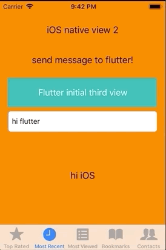
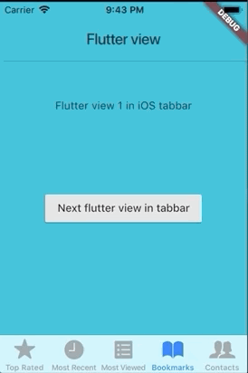

# iOS_Flutter_integration

The main goal of this app is to test possible integration flows when adding a Flutter module to an existing native Swift iOS app.

To run the app go inside flutter_app dir and do the command:
```
flutter pub get
```
After this, go to iOS_app and do the command:
```
pod install
```

The native iOS views are in orange and the Flutter views are in cyan.

1 - Flutter views in an navite tabbar


2 - Navigation from native to two different initial routes in Flutter


3 - Passing parameters from native to Flutter and back


4 - Mixed navigation native / flutter / native



5 - Navigation in a Flutter view inside native tabbar


6 - Navigation from Flutter view to another initial Flutter view and native view


    
  Also in this case, the Flutter view is using plugins to open webview, camera and gallery.
  The idea was to solve conflicts with plugins that were using native resources.
  It was possible to solve by adding a custom Ruby script in the Podfile to make the necessary adjusts
in info.plist inside the generated .ios.


